# Android OnDevice RAG - The RAG Bot

A state-of-the-art, fully local Retrieval-Augmented Generation (RAG) application for Android. This project demonstrates how to run advanced Natural Language Processing tasks—including sentence embeddings, vector database similarity search, document chunking, and LLM text generation—entirely on-device without relying on external cloud APIs (with optional Gemini remote streaming fallback).

## 📱 Screenshots

  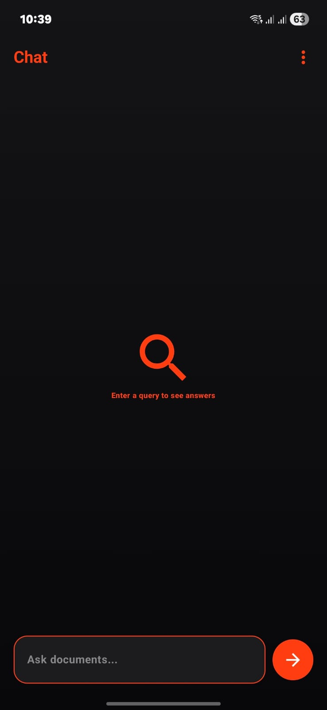
  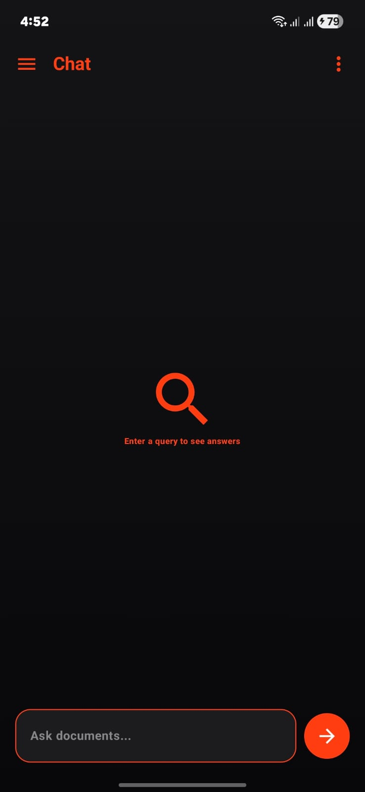
  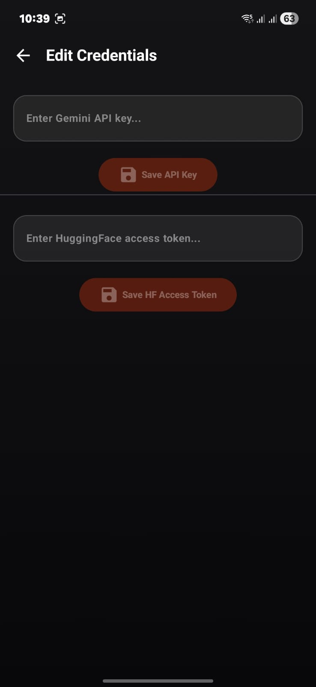
  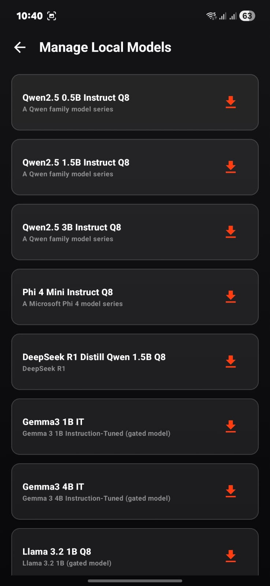
  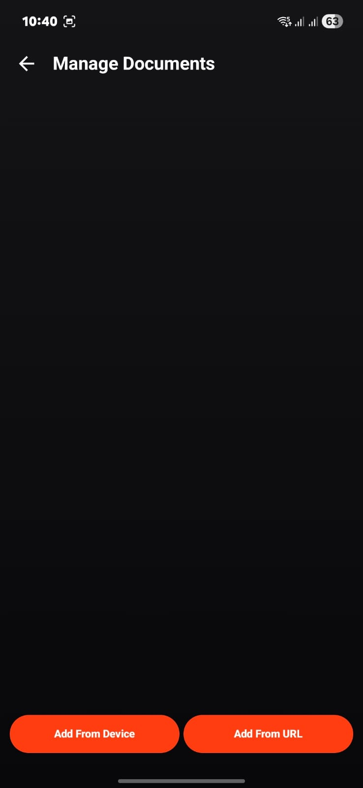
  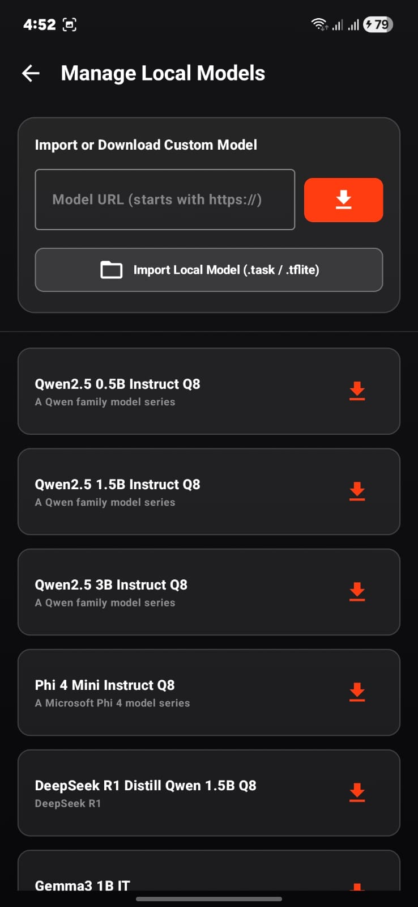
  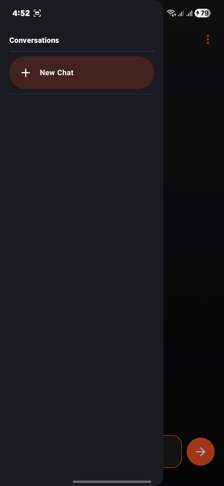
  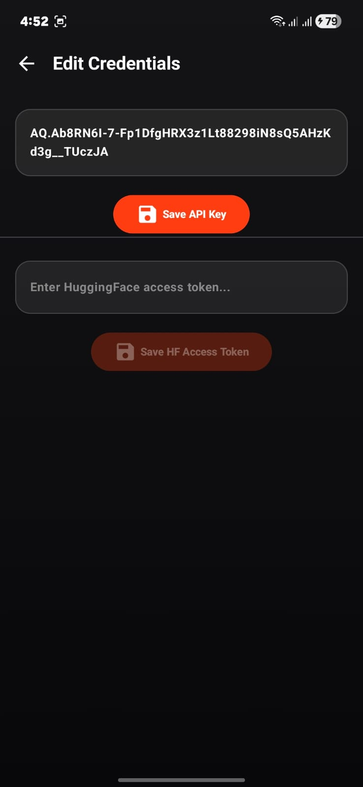
  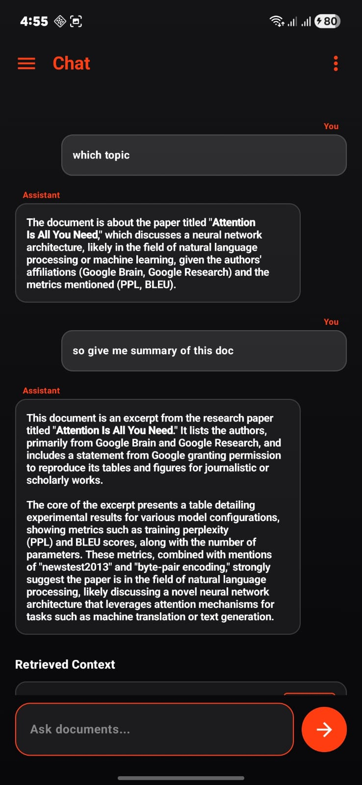
  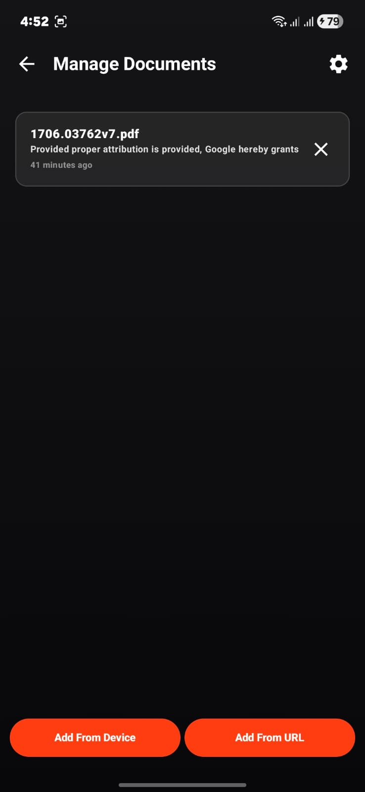
  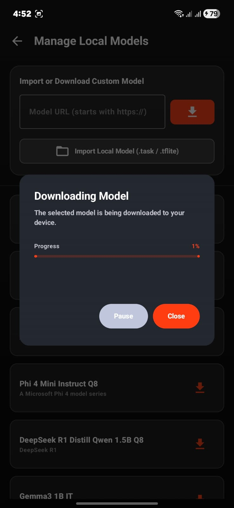

## 🚀 Key Features

*   ⚡ **Real-Time Streaming Responses**: Token-by-token generation for both remote (Gemini API) and local (LiteRT/MediaPipe) LLM engines utilizing Kotlin Coroutine Flows.
*   💬 **Persistent Multi-Turn Chat Sessions**: High-performance conversation logging in an ObjectBox database. Includes conversational memory which injects relevant past turns to the LLM context.
*   ⚙️ **Dynamic Chunking Settings**: Fully configurable settings panel with size and overlap sliders. Supports both basic whitespace-based and regex-based sentence boundary text splitting.
*   🔍 **Similarity Badges & Citations Dialog**: Displays matching cosine distance/similarity score percentages for referenced context cards. Features a clickable card layout showing full source citation details and metadata.
*   📥 **Advanced Local Model Downloader**:
    *   Integrates Ketch download manager with Pause/Resume controls.
    *   Scans internal files directory dynamically to detect and load imported models.
    *   Imports external `.task` / `.tflite` models directly from the local file manager.
    *   Downloads models directly from HuggingFace or custom direct URLs.

---

## 🛠️ Architecture & Tech Stack

*   **UI/UX**: Jetpack Compose, Material Design 3, custom glassmorphism effects, dynamic micro-animations.
*   **Embeddings Generation**: ONNX Runtime Android executing a localized Sentence Embeddings model.
*   **Vector Database**: ObjectBox for local vector indexing, retrieval, and similarity calculation.
*   **LLM Inference Engine**: MediaPipe Tasks GenAI / LiteRT (supporting quantized models like Gemma, Llama, Qwen, Phi, etc.).
*   **Downloader Manager**: Ketch Library for chunked network streams and pause/resume handles.
*   **Dependency Injection**: Koin framework.
*   **Concurrency**: Kotlin Coroutines & Flows for thread-safe asynchronous workloads.

---

## 📦 Getting Started

### 1. Requirements
*   Android Studio Ladybug (or newer).
*   Android SDK version 26 (Android 8.0) or higher.
*   A physical Android device with at least 4GB of RAM (6GB+ recommended for local LLM inference).

### 2. Setting Up Local LLM Models
You can download models directly in-app through the **Manage Local Models** screen:
*   Enter any direct HuggingFace URL (e.g., Qwen2.5-0.5B, Phi 4 Mini, Gemma 3, Llama 3.2).
*   Alternatively, copy your own `.task` or `.tflite` model files to your device and import them using the **Import Local Model** button.

---

## 📄 License
This project is licensed under the Apache License 2.0. See the LICENSE file for details.
